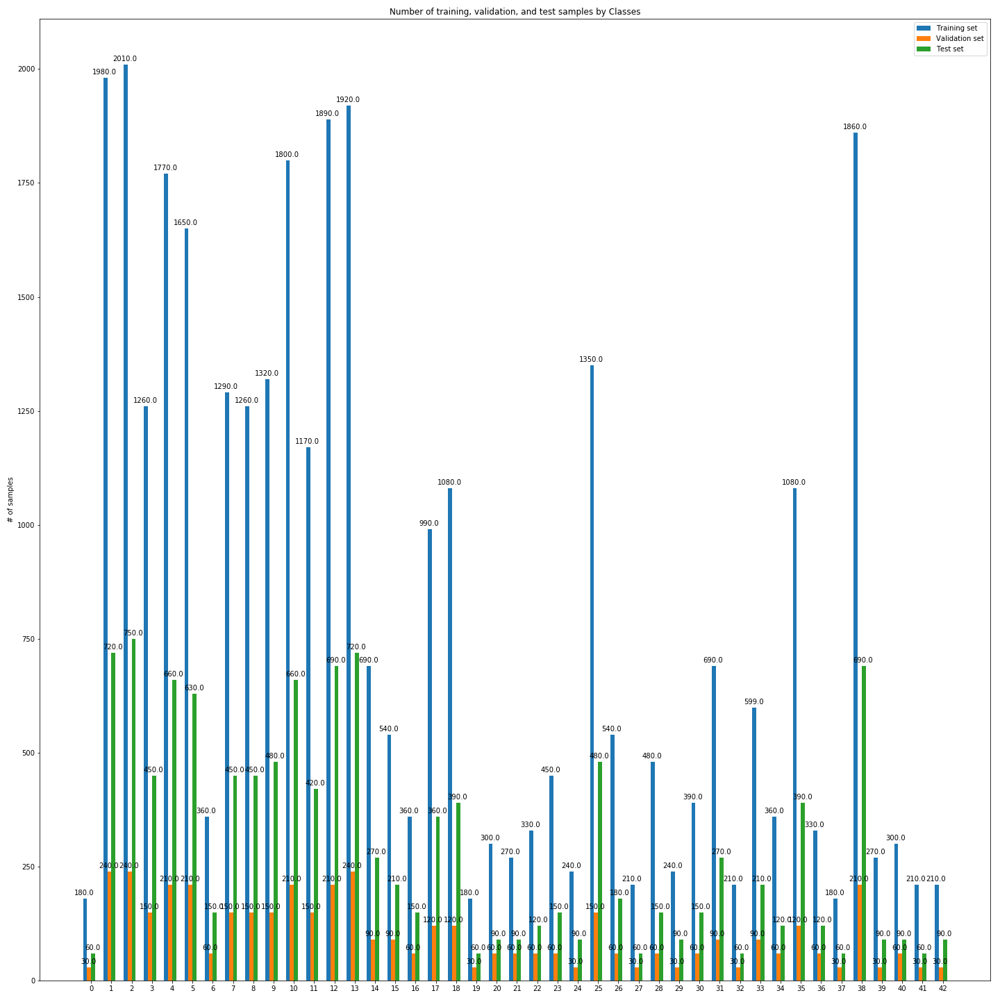
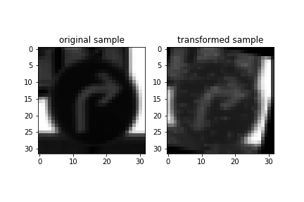
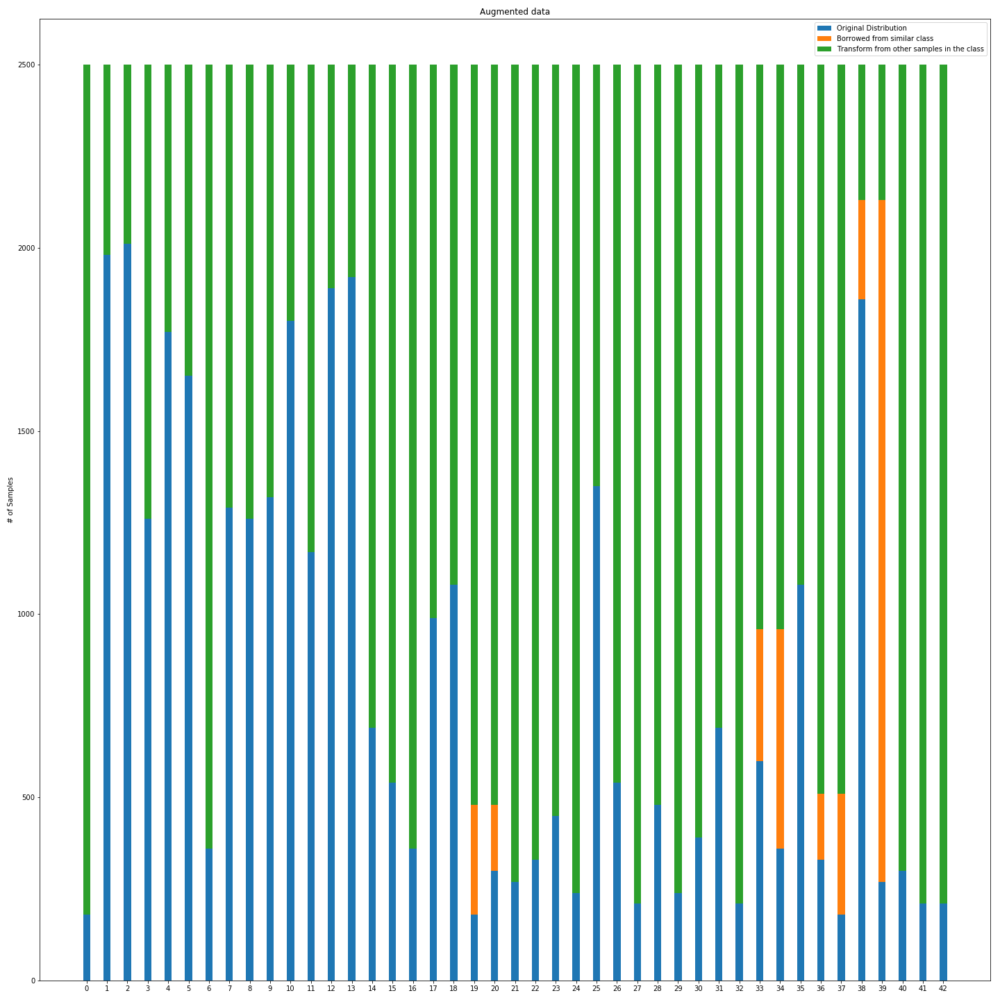
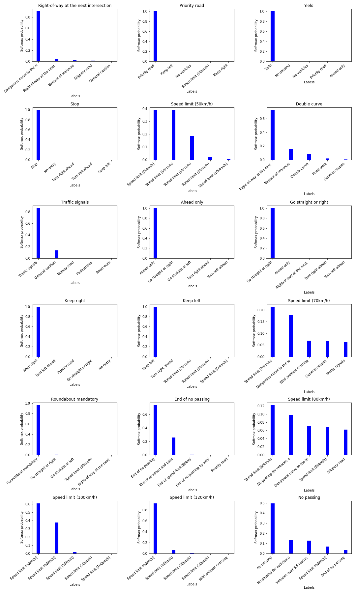

# **Traffic Sign Recognition** 

---

**Build a Traffic Sign Recognition Project**

The goals / steps of this project are the following:
* Load the data set 
* Explore, summarize and visualize the data set
* Design, train and test a model architecture
* Use the model to make predictions on new images
* Analyze the softmax probabilities of the new images
* Summarize the results with a written report

## How to run
install conda, and create an environment based on the yml file provided
```bash
conda env create -f carnd-lenet.yml
```
activate the environment and run the jupyter notebook

```bash
activate carnd-clone
jupyter notebook Traffic_Sign_Classifier.ipynb
```
Download [German Traffic Sign Dataset](https://s3-us-west-1.amazonaws.com/udacity-selfdrivingcar/traffic-signs-data.zip), and extract to ../data/

the project is implemented in the Traffic_Sign_Classifier.ipynb

---


### Data Set Summary & Exploration

#### 1. Summary of dataset

I used the numpy and built-in libraries to calculate summary statistics of the traffic
signs data set:

* The size of training set is 34799 samples.
* The size of the validation set is 4410 samples.
* The size of test set is 12630 samples.
* The shape of a traffic sign image is 32x32x3,
* The number of unique classes/labels in the data set is 43.

#### 2. Exploratory visualization of the dataset.

Here is an exploratory visualization of the data set. It is a bar chart showing how the data is distributed between classes. As it is shown in the figure below,training data, validation data, and test data are distributed similarly. However, the dataset distribution is imbalanced. this is the case for most of the real-life datasets. imbalanced dataset can raise the false negative predictions, resulting a lower sensivity(recall) and f1 score for the model. one way to solve is over-sampling which is described later in the preprocessing stage. 

<figure>

</figure>
The image below shows one random image from each class. as it can be seen, the images are taken in different lighting conditions, some are obscured, and some are taken from the different angels. this would result in the generlized model which would classify the new images more accurately.
<figure>

</figure>


### Design and Test a Model Architecture

#### 1. Pre-processing

First, I decided to convert the images to grayscale because first this conversion reduces the amount of input data to the model and expedites the training. second, the traffic sign images have different colors at the boarders, and also, in different lighting conditions, colors might look different, the grayscale image helps to eliminate the dependency on the color. third, based on [this paper](http://yann.lecun.com/exdb/publis/pdf/sermanet-ijcnn-11.pdf), the accuracy of the model increases by ignoring the color. 

Here is an example of a traffic sign image before and after grayscaling.

<figure>

</figure>

Next, I decided to generate synthetic data, since at it can be seen in <a href="./res/dataset_distribution.png">dataset distribution</a>, the some classes certainly lack samples. for instance, for "Speed limit 20 km/h" class (class 0), the model has to classify 60 images correctly after seeing only 180 images. 

one way to add more data is to barrow samples from other classes, convert them so that they look like distination class samples. this can be done by "fipped" vertically or horizontally. for example, one sample from "go straight or left" class can be easily mirrored horizontally and turned into "go straght or right" sample and vice versa. this, also, works for the following pairs: "Dangerous curve to the left" and "Dangerous curve to the right", "turn right ahead" and "turn left ahead", "keep right" and "keep left". 

<figure>

</figure>

The next step is transform the images in same class to get new samples. this is done by adding random noise to image, then rotating the image by a random degree between 0 and 15 around a random point at the center, and finally making a random transtion on the image. also, samples from some traffic sign images can be flipped vertically and/or horizontally and still keep their meaning, such as "No Entry" sign flipped vertically and horizontally has the same meaning. this is, also, applied to the images of those classes by random to create new samples.

<figure>

</figure>

at the end, the number of images of each class reached to 2500 samples, making 107500 samples, of which 4079 samples are taken from other classes, and 68622 samples are synthetic.

<figure>

</figure>

As a last step, I normalized the image data because it prevent the weights and biases to get too big or too small; therefore, it will help the optimizer to find the numerical solution faster.


#### 2. Model architecture 

 The final model looks like the [sermanet](http://yann.lecun.com/exdb/publis/pdf/sermanet-ijcnn-11.pdf) except the size of the laters are different:

<figure>

</figure>

My final model consisted of the following layers:

| Layer         		|     Description	        					| 
|:---------------------:|:---------------------------------------------:| 
| Input         		| 32x32x1 Grayscale image   					| 
| Convolution 5x5     	| 1x1 stride, valid padding, outputs 28x28x54 	|
| RELU					|												|
| Max pooling 2x2      	| 2x2 stride,  outputs 14x14x54 				|
| Dropout           	|                               				|
| Convolution 5x5	    | 1x1 stride, valid padding, outputs 10x10x100	|
| RELU					|												|
| Max pooling 2x2       | 2x2 stride,  outputs 5x5x100 				    |
| Dropout           	|                               				|
| Fully connected		| 120 neurons  									|
| Dropout           	|                               				|
| Fully connected		| 84 neurons  									|
| Dropout           	|                               				|
| Fully connected		| 43 neurons  									|
| Softmax				|           									|
|       				|           									|
 


#### 3. Training the model. 

To train the model, I used Adam optimizer and 128 for the batch size as it was used in the LeNet. I increased number of epochs to 100 and I chose the learning to be 0.0005. 

#### 4. Discusstion on the model performance

My final model results were:
* training set accuracy of **0.985**.
* validation set accuracy of **0.987**. 
* test set accuracy of **0.965**.

I started from the LeNet architecture since its performance is fairly good on the MNIST dataset and traffic sign dataset, although more complicated, is similar to the MNIST. 

I chose to add more complexity to the LeNet model to make it suitable for the traffic sign classifier. By increasing the convolution layers filter count, the model can recognize more details at the first stage, and more shapes at the second stage. with this modification, the model accuracy on test dataset reached to 94 percent. However, it didn't seem satisfying to me because the permforamance on the new test images was dismal (around 40 percent).

Therefore, i decided to add dropout regulization to prevent the overfitting since the accuracy on the training set was above 98 percent, so I suspected the model overfit the training set. this suprisingly decreased the accuracy. i realized since half of the parameter are set to zero randomly, the training must continue for more epochs. by increasing the number of epochs and lowering the learning rate, the accuracy on the validation reached to 98.7 percent. and finally test dataset accuracy increased to 96.5 percent. 

This is how training and validation accuracy changed during the training:

<figure>

</figure>

also, based on the [sermanet](http://yann.lecun.com/exdb/publis/pdf/sermanet-ijcnn-11.pdf) i added a subsampling from the first stage to the fully connected classifier. Contrary to the result in the paper, multiscaling (adding the subsampling from first stage) did not help the final result in this case. I tested this architecture with subsampling with the kernel size 2 and 4; the accuracy results respectively are on training set 0.986 and 0.988, on the validation set 0.974 and 0.957. Using the **rule of 30**, since the validation set has 4410 samples, the multiscaling is significantly decreases the accuracy (30 samples difference means 0.6 percent change). I decided to disable the multiscaling for this architecture. there are a couple reasons why I couldn't get the performance improvement after adding the multiscaling; first, i reduce the number of filters at the first stage due to the hardware limitation on my machine. Another reason can be the activation function choise is different in this paper (|tanh|). Also, I trained the model for 80 epochs while the model can be trained for more epochs without overfitting since the dropout method is used for regulization.  

##### Precision, Recall, and F1-score

Moreover, i studied the precision, recall, and F1-score on the test set results. Here is the precision, recall, and F1-score for each class. as it is illistrated in the table below, the model has high precision for almost all classes which means the model's prediction is reliable. Also, the recall is at same range of the precision which indicates that the model is sensetive.


|                                                  |precision    |recall   |f1-score   | support  |
|-------------------------------------------------:|:-----------:|:-------:|:---------:|:--------:| 
|                             Speed limit (20km/h) |      0.98   |  1.00   |  0.99     |      60  |
|                             Speed limit (30km/h) |      0.99   |  0.99   |  0.99     |     720  |
|                             Speed limit (50km/h) |      0.98   |  0.99   |  0.98     |     750  |
|                             Speed limit (60km/h) |      0.95   |  0.94   |  0.94     |     450  |
|                             Speed limit (70km/h) |      0.98   |  0.97   |  0.97     |     660  |
|                             Speed limit (80km/h) |      0.95   |  0.96   |  0.95     |     630  |
|                      End of speed limit (80km/h) |      1.00   |  0.91   |  0.95     |     150  |
|                            Speed limit (100km/h) |      0.99   |  0.90   |  0.94     |     450  |
|                            Speed limit (120km/h) |      0.89   |  0.99   |  0.94     |     450  |
|                                       No passing |      0.99   |  0.99   |  0.99     |     480  |
|     No passing for vehicles over 3.5 metric tons |      1.00   |  1.00   |  1.00     |     660  |
|            Right-of-way at the next intersection |      0.99   |  0.94   |  0.96     |     420  |
|                                    Priority road |      0.99   |  0.98   |  0.98     |     690  |
|                                            Yield |      1.00   |  1.00   |  1.00     |     720  |
|                                             Stop |      1.00   |  1.00   |  1.00     |     270  |
|                                      No vehicles |      0.99   |  1.00   |  0.99     |     210  |
|         Vehicles over 3.5 metric tons prohibited |      0.97   |  1.00   |  0.99     |     150  |
|                                         No entry |      1.00   |  0.99   |  1.00     |     360  |
|                                  General caution |      1.00   |  0.89   |  0.94     |     390  |
|                      Dangerous curve to the left |      0.81   |  1.00   |  0.90     |      60  |
|                     Dangerous curve to the right |      0.85   |  1.00   |  0.92     |      90  |
|                                     Double curve |      0.87   |  0.99   |  0.93     |      90  |
|                                       Bumpy road |      0.97   |  0.85   |  0.91     |     120  |
|                                    Slippery road |      0.84   |  0.95   |  0.89     |     150  |
|                        Road narrows on the right |      0.98   |  0.98   |  0.98     |      90  |
|                                        Road work |      0.98   |  0.95   |  0.97     |     480  |
|                                  Traffic signals |      0.92   |  1.00   |  0.96     |     180  |
|                                      Pedestrians |      0.77   |  0.50   |  0.61     |      60  |
|                                Children crossing |      0.99   |  0.99   |  0.99     |     150  |
|                                Bicycles crossing |      0.84   |  0.98   |  0.90     |      90  |
|                               Beware of ice/snow |      0.78   |  0.79   |  0.78     |     150  |
|                            Wild animals crossing |      0.99   |  1.00   |  1.00     |     270  |
|              End of all speed and passing limits |      1.00   |  1.00   |  1.00     |      60  |
|                                 Turn right ahead |      1.00   |  1.00   |  1.00     |     210  |
|                                  Turn left ahead |      0.95   |  1.00   |  0.98     |     120  |
|                                       Ahead only |      0.99   |  0.99   |  0.99     |     390  |
|                             Go straight or right |      0.94   |  1.00   |  0.97     |     120  |
|                              Go straight or left |      0.73   |  1.00   |  0.85     |      60  |
|                                       Keep right |      0.99   |  0.94   |  0.97     |     690  |
|                                        Keep left |      0.92   |  0.99   |  0.95     |      90  |
|                             Roundabout mandatory |      0.64   |  0.83   |  0.72     |      90  |
|                                End of no passing |      1.00   |  0.92   |  0.96     |      60  |
|End of no passing by vehicles over 3.5 metric tons|      0.98   |  1.00   |  0.99     |      90  |
|                                  **avg / total** |    **0.97** |**0.97** |**0.97**   | **12630**|
                                       
##### Confusion Matrix
Below the confusion matrix is shown with the actual label on the rows and predictions on the columns. the model has trouble distiguishing between speed limit signs. this can be because the architecture is not complex enough, and can't detect the details very well.

<figure>

</figure>

### Test a Model on New Images

#### 1. Discusstion on images

Here are eighteen traffic signs that I found on the [STSD](https://www.cvl.isy.liu.se/research/datasets/traffic-signs-dataset/):

<figure>

</figure>

 The Swedish traffic signs are quite similar to their German counterparts; however, most of the signs have yellow-background. also, the stop sign is from a different angle. "keep left" sign is covered with some horizontal lines. Other images are taken in different lighting condition.


#### 2. Discussion on  the model's predictions on the new traffic signs 


Here are the results of the prediction:

<figure>

</figure>


The model was able to correctly guess 12 of the 18 traffic signs, which gives an accuracy of 67%.

Let's look at the predictions; I grouped the discussion for some similar predictions to avoid repetition.  
 
##### Speed limit signs
The result of the speed limit signs predictions match the confusion matrix. the model is not precise when it comes to the number in the sign; however, the general shape of the sign is predicted correctly as speed limit sign. based on the <a href="./res/Top5Softmax.png">**top 5 probablities**</a> below, the model is not certain which traffic sign matches the sample. Even in the "speed limit 70(km/h)" case, although the prediction is correct, the next high probablity is almost as high as the correct class probability. the best example of this kind is the "speed limit 50(km/h)" when the model is confused between the all speed limit signs. in the confusion matrix, also, the speed limit sign are mistaken instead of each other. this indicates the architecture needs to be more complex to catch the detail of the image better. 

##### Priority road, yield, stop, ahead only, go straight or right, keep left, and keep right signs
For these images, from what it is illustrated in the top 5 probabilities, the probability of the correct prediction is high which can be backed up with the above 0.99 precision and recall. 

##### Right-of-way at the next intersection sign
The model, based on the <a href="./res/Top5Softmax.png">**top 5 probablities**</a> below, with high probablity miss-classified this image to "Dangerous curve to the right". looking at the precision for the predicted class we get 0.81, and the recall for the actual class is 0.94. this makes sense since the precision is low in predicted class the model prediction can be wrong.

#####  Trffic signals, end of no passing, and no passing signs
This signs are classified correctly; however, the next high probablity is relatively high, so i though it is worth a separate discussion. Since the precision and recall for this images are high, the model classifies these images with relatively high confidence. Meanwhile, in there are classes which are close to correct class like "general caution" is close to the "traffic signals", or "no passing" is similar to "no passing for vehicles over 3.5 metric tons". This means they have similar "features". Therefore, when our model wants to classify these signs, the similar classes are, also, get some vote. This means our model is on the right track and detect right kind of features.

##### Roundabout mandatory

For this image, the precision is low (0.64)and recall is high (0.83), so it is expected that the model have a low confidence in the prediction, which based on the top 5 probablities, this is not the case. not only is the prediction correct, but also the probablity for this prediction is almost 1. the reason is although the model has low precision and sensivity on this class, to some extent, it can still classify the images correctly. 

##### Double curve

this image is miss-classified to "right-of-way at the next intersection". the precision for the predicted class is 0.99, and recall for the actual class is 0.99. also, the probablity of the predicted class is 0.7. the reason is, like the previous case, having the high precision and recall doesn't mean the model is 100 percent is right always.


<figure>

</figure>


### Future work

From the discussions above, for future work, I would recommed a more complex,deeper architecture like AlexNet which can capture more details in the image. Also, increasing the size of the data set would definitively help. 


```python

```
